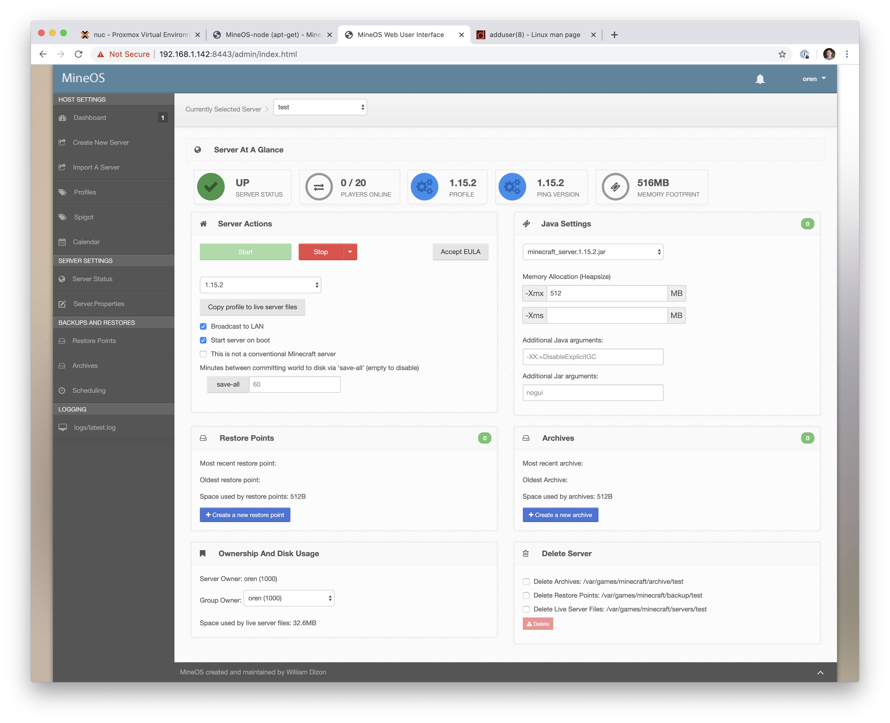

Need to automate this. In the meantime, here are notes on homelab setup

## Enabling Docker in LXC

In `/etc/pve/local/lxc/<ID>.conf` append

```
features: keyctl=1,nesting=1
```

Found instructions in [this forum post](https://discuss.linuxcontainers.org/t/working-install-of-docker-ce-in-lxc-unprivileged-container-in-proxmox/3828)

## Setup MineOS

### Notes

* Crete a LXC container based on whatever (I did debian 10).
* I alloced 1GB to the LXC container
* Gave it 4 cores. 
* Console never responded
* Ran `pct enter <ID>` to get into the LXC, then `apt update && apt upgrade` and then console worked.
* `apt install openssh-server`
* Seems to need at least 512MB of ram for the Minecraft process itself. 

### Instructions

From [these instructions](https://github.com/hexparrot/mineos-node)

Create a user to run as
```
useradd -m USERNAME (or adduser USERNAME for interactive)
```

Install mineos
```
apt update
apt-get install -y npm rsync nodejs git rdiff-backup screen build-essential openjdk-11-jre-headless
mkdir -p /usr/games
cd /usr/games
git clone https://github.com/hexparrot/mineos-node.git minecraft
cd minecraft
git config core.filemode false
chmod +x service.js mineos_console.js generate-sslcert.sh webui.js
ln -s /usr/games/minecraft/mineos_console.js /usr/local/bin/mineos
cp mineos.conf /etc/mineos.conf
npm install --unsafe-perm
./generate-sslcert.sh
```

Then enable it

```
cp /usr/games/minecraft/init/systemd_conf /etc/systemd/system/mineos.service
systemctl enable mineos
systemctl start mineos
```

setup some profiles. Here's what my setup screen looked like:



## Useful Links

* [Proxmox useful CLI](https://www.hungred.com/how-to/server/list-of-useful-proxmox-command/)